# 多智能体气候政策模型 (Climate Policy ABM) - 简化版本

## 📋 目录
- [模型概述](#模型概述)
- [企业架构设计](#企业架构设计)
- [理论基础](#理论基础)
- [核心改进](#核心改进)
- [系统架构](#系统架构)
- [使用指南](#使用指南)
- [校准与验证](#校准与验证)
- [实验设计](#实验设计)
- [结果分析](#结果分析)
- [扩展指南](#扩展指南)
- [技术文档](#技术文档)

## 🎯 模型概述

### 研究目标
本模型旨在研究气候政策（特别是排放税、绿色补贴等）对农业系统中企业异质性、技术创新和市场结构的影响机制。通过多智能体建模方法，分析政策干预如何通过影响企业的技术选择、产品质量投资和市场行为，最终推动整个农业系统的绿色转型。

### 核心研究问题
1. **企业异质性影响**：不同技术水平和质量投资的企业如何响应气候政策？
2. **市场机制设计**：基于质量的供需匹配如何影响政策效果？
3. **技术扩散路径**：绿色技术在异质性企业间的扩散机制？
4. **政策最优化**：不同政策工具的效果差异及最优组合？

### 简化设计原则

根据经济学理论，本模型采用简化但科学的企业设定：

#### **企业异质性的经济学基础**
每个企业 $i$（$i = 1, 2, ..., I = \sum_s I_s$）生产一种主要产品 $g$（$g = 1, 2, ..., G$），使用劳动力、资本和来自其他企业的中间投入。企业 $i$ 隶属于某个产业或部门 $s$（$s = 1, 2, ..., S$），每个产业有 $I_s$ 个企业。

**关键设定**：
- **同类型企业只生产一种产品**，但每个企业生产的这种产品具有**异质性**
- **异质性来源**：技术水平、质量投资、研发投资、声誉等科学化指标
- **不确定性环境**：企业面临未来销售额、市场价格、投入可得性、工资、现金流等根本不确定性
- **预期形成**：每个企业必须对未来形成预期，而这些预期可能与实际情况不符

## 🏗️ 企业架构设计

### 简化的企业分类体系

基于农业经济现实和建模简化需要，本模型设定**六大类企业**：

#### **1. 工业企业（3类）- 上游供给**
这些企业为农业生产提供工业投入品，是农业现代化的重要支撑：

##### `agents.PesticideEnterpriseAgent` - 农药企业
```matlab
% 核心异质性属性
properties:
    product_quality         % [0.3,1.0] 产品质量指数
    technology_level        % [0.3,1.0] 生产技术水平  
    quality_investment      % [0.01,0.08] 质量投资比例
    rd_investment          % [0.005,0.06] 研发投资比例
    reputation             % [0,1] 企业市场声誉
    emission_rate          % [0.05,0.2] 单位产出排放系数
    production_capacity    % [1000,50000] 年产能（吨）
    market_share          % [0,1] 当前市场份额
end

% 质量生产函数（CES形式）
Q = [α_T·T^ρ + α_Q·QInv^ρ + α_R·RD^ρ + α_Rep·Rep^ρ]^(1/ρ)
其中：α_T=0.35, α_Q=0.30, α_R=0.25, α_Rep=0.10, ρ=-0.4
```

##### `agents.FertilizerEnterpriseAgent` - 化肥企业  
```matlab
% 专业化异质性属性
properties:
    nitrogen_efficiency     % [0.6,0.95] 氮肥利用效率
    phosphorus_efficiency   % [0.5,0.90] 磷肥利用效率
    organic_content_ratio   % [0,0.3] 有机成分比例
    green_tech_adoption     % [0,1] 绿色技术采用水平
    carbon_footprint        % [1.0,2.5] 碳足迹（吨CO2/吨产品）
    waste_recycling_rate    % 废料回收利用率
end
```

##### `agents.AgroProcessingEnterpriseAgent` - 农产品加工企业
```matlab
% 加工业务异质性
properties:
    processing_capacity      % [1000,20000] 年加工能力（吨）
    input_quality_requirement % [0.5,0.9] 原料质量要求
    contract_farming_ratio    % [0,0.6] 订单农业比例
    automation_level         % [0.1,0.8] 自动化水平
    value_added_ratio        % [0.2,0.8] 增值比例
end
```

#### **2. 农业生产企业（3类）- 核心生产**
**严格限定为三类农业生产企业**，体现农业生产的基本分化：

##### `agents.GrainFarmAgent` - 粮食作物生产企业
专业化生产小麦、玉米、水稻等粮食作物，注重稳定性和规模效应。

##### `agents.CashCropFarmAgent` - 经济作物生产企业  
专业化生产棉花、油料、糖料等经济作物，注重市场价值和品质。

##### `agents.MixedCropFarmAgent` - 混合作物生产企业
同时生产粮食作物和经济作物，分散风险但可能牺牲专业化效率。

**重要说明**：**不考虑畜牧业等其他农业生产企业**，模型聚焦于种植业。

#### **3. 农业服务企业（1类）- 技术服务**

##### `agents.AgriculturalServiceEnterpriseAgent` - 农业服务企业
```matlab
% 服务能力异质性
properties:
    service_types = {'machinery', 'technical_consulting', 'plant_protection'}
    service_capacity = struct()     % 各类服务能力
    service_quality = struct()      % 各类服务质量
    technology_level = 0.6          % 技术水平 [0-1]
    technical_expertise = 0.5       % 技术专长 [0-1]
    service_coverage_radius = 20    % 服务覆盖半径（公里）
end
```

### 企业异质性机制

#### **科学化异质性表征（替代"品牌强度"）**

**1. 多维异质性向量**
```matlab
Enterprise_Heterogeneity_i = [Tech_i, Quality_Investment_i, RD_Investment_i, Reputation_i]
```

**2. 技术水平内生化**
```matlab
Tech_{i,t+1} = Tech_{i,t} × (1 + δ_tech) × (1 + λ_RD × RD_{i,t}) × (1 + λ_spillover × TechSpillover_{i,t})
```

**3. 产品质量函数**
```matlab
Quality_{i,t} = A_quality × [α_T×Tech_{i,t}^ρ + α_Q×QualityCapital_{i,t}^ρ + 
                             α_R×RDStock_{i,t}^ρ + α_Rep×Reputation_{i,t}^ρ]^(1/ρ)
```

**4. 声誉动态演化**
```matlab
Reputation_{i,t+1} = α_rep × Reputation_{i,t} + (1-α_rep) × TargetReputation_{i,t} + shock_{i,t}
```

### 市场机制简化

#### **基于质量的双边匹配**
```matlab
% 匹配效用函数
U(demander, supplier) = w_quality×QualityUtility + w_price×PriceUtility + 
                       w_reputation×ReputationUtility - SearchCost

其中：
QualityUtility = exp(-|supplier.quality - demander.quality_preference|²/2σ²)
PriceUtility = exp(-price_sensitivity × normalized_price)
ReputationUtility = 1/(1 + exp(-reputation_slope × (supplier.reputation - 0.5)))
```

## 🏛️ 理论基础

### 1. 微观经济学基础

#### 1.1 企业理论与异质性建模

##### 新古典企业理论扩展
基于新古典企业理论，我们构建了考虑技术异质性和质量投资的生产函数：

```matlab
% 企业i的生产函数（Cobb-Douglas形式）
Y_i = A_i × K_i^α × L_i^β × Q_i^γ

其中：
Y_i: 企业i的产出
A_i: 全要素生产率（技术水平）∈ [0.3, 1.0]
K_i: 资本存量 ∈ [10000, 500000]
L_i: 劳动投入 ∈ [5, 200]
Q_i: 质量资本 ∈ [0.3, 1.0]
α = 0.4 (资本产出弹性)
β = 0.35 (劳动产出弹性) 
γ = 0.25 (质量产出弹性)
```

#### 1.2 产业组织理论应用

##### 市场结构内生化（基于Melitz 2003）
不同生产率企业的市场准入和退出决策：

```matlab
% 企业市场准入条件
π_i ≥ f_entry + f_fixed

其中：
π_i: 企业i的期望利润
f_entry = 5000: 进入固定成本
f_fixed = 1200: 每期固定成本

% 利润函数（考虑质量溢价）
π_i = (P_i - mc_i) × Q_i - FC_i - EnvCost_i - QualityCost_i

P_i = mc_i × (1 + markup_i) × QualityPremium_i
QualityPremium_i = 1 + κ × (Quality_i - AvgQuality)
κ = 0.25: 质量溢价弹性
```

### 2. 环境经济学理论

#### 2.1 庇古税理论扩展

```matlab
% 最优排放税率
τ* = MED(E*): 最优税率等于最优排放水平下的边际环境损害

% 边际环境损害函数（非线性）
MED(E) = α_env × E + β_env × E² + γ_env × E³

参数标定：
α_env = 50: 线性损害系数（元/吨CO2当量）
β_env = 0.02: 二次项系数
γ_env = 0.0001: 三次项系数
```

#### 2.2 绿色技术补贴理论

```matlab
% 差别化补贴函数
Subsidy_i = s_base × TechUpgrade_i + s_performance × (TechLevel_{i,new} - TechLevel_{i,old})

其中：
s_base = 0.3: 基础补贴率
s_performance = 0.5: 绩效补贴系数
```

### 3. 预期形成理论

#### 3.1 AR(1)自适应学习机制

每个智能体基于历史数据形成对未来的预期：

```matlab
% AR(1)预期形成过程
E_t[X_{t+h}] = α + β × X_t + γ × trend_t + ε_t

其中：
α, β, γ: 通过递归最小二乘法在线学习的参数
h: 预测期数
trend_t: 趋势项
```

#### 3.2 置信度调整机制

```matlab
% 预期置信度计算
Confidence_t = exp(-λ × RMSE_t)

其中：
λ: 置信度衰减系数
RMSE_t: 滚动预测均方根误差
```

## 🚀 核心改进

### 1. 企业异质性机制重构

#### 原有设计的问题
```matlab
% 原有简化设计的问题
brand_strength = 0.5 + 0.5 * rand;  % 抽象概念，缺乏理论基础
price_premium = base_price * (1 + 0.05 * brand_strength);
```

#### 新的科学化设计

**1.1 多维异质性建模框架**
```matlab
% 企业异质性四维向量
Enterprise_Heterogeneity_i = [Tech_i, Quality_Investment_i, RD_Investment_i, Reputation_i]

% 技术水平建模（基于内生增长理论）
Tech_{i,t+1} = Tech_{i,t} × (1 + δ_tech) × (1 + λ_RD × RD_{i,t}) × (1 + λ_spillover × TechSpillover_{i,t})

其中：
δ_tech = 0.015: 外生技术进步率（年1.5%）
λ_RD = 0.12: R&D对技术进步的弹性
λ_spillover = 0.08: 技术溢出弹性
```

**1.2 产品质量内生化机制**
```matlab
% 质量生产函数（多要素CES形式）
Quality_{i,t} = A_quality × [α_T×Tech_{i,t}^ρ + α_Q×QualityCapital_{i,t}^ρ + 
                             α_R×RDStock_{i,t}^ρ + α_Rep×Reputation_{i,t}^ρ]^(1/ρ)

参数标定（基于中国制造业调研）：
A_quality = 1.2: 质量全要素生产率
α_T = 0.35: 技术水平贡献份额
α_Q = 0.30: 质量资本贡献份额  
α_R = 0.25: 研发存量贡献份额
α_Rep = 0.10: 声誉贡献份额
ρ = -0.4: 替代弹性参数
```

### 2. 市场机制精细化改进

#### 2.1 从价格撮合到质量匹配

**双边搜寻匹配机制**
```matlab
% 双边搜寻匹配算法（Gale-Shapley稳定匹配改进版本）
function [matches, welfare] = quality_based_matching(suppliers, demanders, market_params)
    % 第一阶段：计算所有可能匹配的效用
    utility_matrix = calculate_utility_matrix(suppliers, demanders);
    
    % 第二阶段：考虑搜寻成本的最优匹配
    [optimal_assignment, total_welfare] = solve_assignment_problem(utility_matrix, search_costs);
    
    % 第三阶段：匹配稳定性检验
    stable_matches = stability_check(optimal_assignment, utility_matrix);
    
    return stable_matches, total_welfare;
end
```

**匹配效用函数**
```matlab
% 多属性效用理论（MAUT）
utility = w_quality × quality_utility + 
          w_price × price_utility + 
          w_reputation × reputation_utility - 
          distance_cost - search_cost

其中：
quality_utility = exp(-quality_distance²/(2×quality_variance))
price_utility = exp(-price_sensitivity × normalized_price)
reputation_utility = 1/(1 + exp(-reputation_slope × (reputation - 0.5)))
```

### 3. 预期形成机制完善

#### 3.1 智能体特定的预期变量

**农药企业预期变量**：
```matlab
expectation_variables = {'farmer_demand', 'input_material_cost', 'competition_intensity',
                        'regulation_stringency', 'environmental_tax_rate', 'pest_outbreak_prob'}
```

**化肥企业预期变量**：
```matlab
expectation_variables = {'crop_planting_area', 'organic_fertilizer_trend', 
                        'precision_agriculture_adoption', 'nitrogen_price_volatility'}
```

**农业服务企业预期变量**：
```matlab
expectation_variables = {'service_demand', 'agricultural_income', 'modernization_rate',
                        'technology_trend', 'fuel_price'}
```

## 📊 系统架构

### 智能体类型与层次

```mermaid
graph TB
    A[多智能体气候政策模型<br/>简化版本] --> B[工业企业 3类]
    A --> C[农业生产企业 3类]
    A --> D[服务企业 1类]
    A --> E[农户智能体]
    A --> F[政府智能体]
    A --> G[市场模块]
    
    B --> B1[农药企业<br/>agents.PesticideEnterpriseAgent]
    B --> B2[化肥企业<br/>agents.FertilizerEnterpriseAgent]
    B --> B3[农产品加工企业<br/>agents.AgroProcessingEnterpriseAgent]
    
    C --> C1[粮食作物生产企业<br/>agents.GrainFarmAgent]
    C --> C2[经济作物生产企业<br/>agents.CashCropFarmAgent]
    C --> C3[混合作物生产企业<br/>agents.MixedCropFarmAgent]
    
    D --> D1[农业服务企业<br/>agents.AgriculturalServiceEnterpriseAgent]
    
    E --> E1[小农户<br/>agents.HouseholdAgent]
    
    G --> G1[农药市场<br/>modules.PesticideMarketModule]
    G --> G2[化肥市场<br/>modules.FertilizerMarketModule]  
    G --> G3[商品市场<br/>modules.CommodityMarketModule]
    G --> G4[土地市场<br/>modules.LandMarketModule]
    G --> G5[劳动力市场<br/>modules.LaborMarketModule]
```



### 企业异质性表征

#### 1. 工业企业异质性
```matlab
% 农药企业
properties_PesticideEnterprise:
    product_quality: [0.3,1.0]        % 基于CES质量函数
    technology_level: [0.3,1.0]       % 生产技术水平
    quality_investment: [0.01,0.08]   % 质量投资比例
    rd_investment: [0.005,0.06]       % 研发投资比例
    reputation: [0,1]                 % 市场声誉
    emission_rate: [0.05,0.2]         % 排放系数
```

#### 2. 农业生产企业异质性
```matlab
% 粮食作物企业
properties_GrainFarm:
    crop_yield: [400,800]             % 单产水平（公斤/亩）
    land_scale: [50,500]              % 经营规模（亩）
    mechanization_level: [0.3,0.9]    % 机械化水平
    quality_grade: ['A','B','C']      % 产品质量等级
    market_orientation: [0.2,0.8]     % 市场化程度
```

#### 3. 服务企业异质性
```matlab
% 农业服务企业
properties_ServiceEnterprise:
    service_types: {'machinery','consulting','protection'}
    service_capacity: [500,2000]      % 年服务能力
    service_quality: [0.5,0.9]        % 服务质量
    technical_expertise: [0.4,0.9]    % 技术专长
    coverage_radius: [15,30]          % 服务半径（公里）
```

### 市场匹配机制

#### 质量偏好异质性
```matlab
% 农户质量偏好函数
QualityPreference_i = min_quality + (max_quality - min_quality) × 
                     (1 - exp(-elasticity × (Income_i - subsistence_income)))

其中：
min_quality = 0.3: 最低质量要求
max_quality = 1.0: 最高质量偏好
elasticity = 0.0001: 收入弹性参数
subsistence_income = 30000: 基本生活收入线
```

#### 搜寻成本建模
```matlab
% 搜寻成本函数
SearchCost_{ij} = c_base + c_distance × d_{ij} + c_info × InfoAsymmetry_{ij}

其中：
c_base = 20: 基础搜寻成本
c_distance = 0.5: 距离成本系数
c_info = 15: 信息不对称成本
InfoAsymmetry_{ij} = 1 - HistoricalInteraction_{ij}
```

## 📖 使用指南

### 快速开始

#### 1. 基础仿真运行
```matlab
%% 创建简化的气候政策模型
fprintf('=== 简化版农业ABM模型演示 ===\n');

% 基础参数设定
params = struct();
params.simulation.max_time = 100;
params.enterprises.total_count = 60;  % 总企业数量
params.households.count = 300;

% 企业分布（简化为6类）
params.enterprises.pesticide_count = 10;    % 农药企业
params.enterprises.fertilizer_count = 10;   % 化肥企业  
params.enterprises.processing_count = 10;   % 加工企业
params.enterprises.grain_farm_count = 10;   % 粮食作物企业
params.enterprises.cash_crop_count = 10;    % 经济作物企业
params.enterprises.mixed_crop_count = 5;    % 混合作物企业
params.enterprises.service_count = 5;       % 农业服务企业

% 创建模型实例
model = core.MultiAgentClimatePolicyModel(params);

% 验证企业构成
fprintf('企业构成验证:\n');
enterprise_types = cellfun(@(e) class(e), model.enterprises, 'UniformOutput', false);
unique_types = unique(enterprise_types);
for i = 1:length(unique_types)
    count = sum(strcmp(enterprise_types, unique_types{i}));
    fprintf('  %s: %d个\n', unique_types{i}, count);
end

% 运行仿真
fprintf('\n开始运行简化版仿真...\n');
tic;
model.run_simulation();
elapsed_time = toc;
fprintf('仿真完成，耗时: %.2f秒\n', elapsed_time);

% 生成结果报告
model.generate_results_report();
```

#### 2. 企业异质性分析实验
```matlab
%% 企业异质性对政策效果的影响分析

% === 实验设计 ===
fprintf('=== 企业异质性政策效果分析实验 ===\n');

% 创建不同技术水平的企业组
enterprise_groups = {
    struct('name', 'Low_Tech_Group', ...
           'tech_level_range', [0.2, 0.5], ...
           'rd_intensity_range', [0.005, 0.02], ...
           'quality_investment_range', [0.01, 0.03]),
           
    struct('name', 'High_Tech_Group', ...
           'tech_level_range', [0.6, 0.9], ...
           'rd_intensity_range', [0.03, 0.06], ...
           'quality_investment_range', [0.04, 0.08])
};

% 政策场景
policy_scenarios = {
    struct('name', 'Baseline', 'emission_tax_rate', 0, 'green_subsidy_rate', 0),
    struct('name', 'EmissionTax', 'emission_tax_rate', 0.25, 'green_subsidy_rate', 0),
    struct('name', 'GreenSubsidy', 'emission_tax_rate', 0, 'green_subsidy_rate', 0.15),
    struct('name', 'PolicyMix', 'emission_tax_rate', 0.2, 'green_subsidy_rate', 0.1)
};

% 运行实验
for i = 1:length(enterprise_groups)
    for j = 1:length(policy_scenarios)
        group = enterprise_groups{i};
        policy = policy_scenarios{j};
        
        fprintf('运行: %s × %s\n', group.name, policy.name);
        
        % 设置模型参数
        model_params = params;
        model_params.policy = policy;
        model_params.enterprise_heterogeneity = group;
        
        % 创建和运行模型
        model = core.MultiAgentClimatePolicyModel(model_params);
        model.run_simulation();
        
        % 记录结果
        results{i,j} = model.collect_results();
        results{i,j}.group_name = group.name;
        results{i,j}.policy_name = policy.name;
    end
end

% 分析结果
fprintf('\n=== 政策效果对比 ===\n');
analyze_heterogeneity_results(results);
```

### 高级功能

#### 1. 质量匹配市场实验
```matlab
%% 质量匹配vs价格匹配效果对比

% 配置质量匹配市场
fprintf('=== 质量匹配算法实验 ===\n');
model = core.MultiAgentClimatePolicyModel();

% 提取农药企业和农户
pesticide_enterprises = model.get_enterprises_by_type('agents.PesticideEnterpriseAgent');
agricultural_demanders = [model.get_enterprises_by_type('agents.GrainFarmAgent'), ...
                         model.get_enterprises_by_type('agents.CashCropFarmAgent'), ...
                         model.get_enterprises_by_type('agents.MixedCropFarmAgent')];

% 创建质量匹配市场
quality_market = modules.PesticideMarketModule(pesticide_enterprises, agricultural_demanders);
quality_market.search_cost_factor = 0.05;

% 执行质量匹配
fprintf('执行质量匹配算法...\n');
[matches, welfare] = quality_market.match_supply_demand_by_quality();

% 分析匹配结果
match_efficiency = analyze_matching_efficiency(quality_market);
fprintf('匹配效率: %.3f\n', match_efficiency.efficiency);
fprintf('平均质量匹配度: %.3f\n', match_efficiency.quality_match);
fprintf('价格离散度: %.3f\n', match_efficiency.price_dispersion);
```

#### 2. 政策实验设计
```matlab
%% 设计政策实验

% 基准场景（无政策干预）
baseline_scenario = struct();
baseline_scenario.name = 'Baseline';
baseline_scenario.emission_tax_rate = 0;
baseline_scenario.green_subsidy_rate = 0;
baseline_scenario.compliance_penalty_rate = 0;

% 政策干预场景
policy_scenarios = {
    struct('name', 'EmissionTax_Low', 'emission_tax_rate', 0.1, 'green_subsidy_rate', 0),
    struct('name', 'EmissionTax_High', 'emission_tax_rate', 0.3, 'green_subsidy_rate', 0),
    struct('name', 'GreenSubsidy', 'emission_tax_rate', 0, 'green_subsidy_rate', 0.15),
    struct('name', 'PolicyMix', 'emission_tax_rate', 0.2, 'green_subsidy_rate', 0.1)
};

% 运行所有场景
all_scenarios = [baseline_scenario, policy_scenarios];
scenario_results = run_policy_scenarios(all_scenarios);

% 对比分析
compare_policy_scenarios(scenario_results);
```

## 🔬 校准与验证

### 校准目标设定
基于中国农业系统的实际数据：

```matlab
calibration_targets = struct(...
    'enterprise_productivity_growth', 0.03, ...     % 年均3%生产率增长
    'technology_adoption_rate', 0.15, ...           % 15%技术采用率
    'market_concentration_hhi', 0.25, ...           % HHI指数0.25
    'price_volatility', 0.12, ...                   % 12%价格波动率
    'emission_reduction_rate', 0.08, ...            % 8%年减排率
    'quality_premium_range', [0.1, 0.4] ...         % 10%-40%质量溢价
);
```

### 验证指标体系

#### 1. 统计验证
- **RMSE**: 预测精度
- **MAE**: 预测偏差  
- **相关系数**: 趋势一致性
- **K-S检验**: 分布一致性

#### 2. 模式匹配验证
- **企业规模分布**: 重尾特征
- **价格波动聚集**: 时间聚集性
- **技术扩散曲线**: S型扩散模式

#### 3. 行为验证
- **学习曲线**: 智能体适应性
- **决策一致性**: 行为稳定性
- **网络形成**: 关系网络演化

## 📊 实验设计

### 核心实验场景

#### 1. 基线场景（Baseline）
```matlab
baseline_params = struct(...
    'emission_tax_rate', 0, ...
    'green_subsidy_rate', 0, ...
    'compliance_penalty_rate', 0 ...
);
```

#### 2. 政策冲击实验
```matlab
% 排放税政策冲击
tax_shock_params = struct(...
    'emission_tax_rate', [0.1, 0.2, 0.3], ...
    'implementation_period', 24, ...
    'phase_in_rate', 0.1 ...
);

% 绿色补贴政策冲击  
subsidy_shock_params = struct(...
    'green_subsidy_rate', [0.05, 0.10, 0.15], ...
    'eligibility_threshold', 0.6, ...
    'budget_constraint', 1000000 ...
);
```

#### 3. 技术冲击实验
```matlab
% 外生技术冲击
tech_shock_params = struct(...
    'shock_magnitude', 0.2, ...        % 20%技术水平提升
    'affected_enterprises', 'random', ...  % 随机影响企业
    'diffusion_rate', 0.1 ...          % 10%扩散率
);
```

## 🎯 主要贡献

### 1. 理论创新
- **企业异质性科学化建模**：从抽象"品牌影响力"转向基于技术水平和产品质量的科学化表征
- **质量匹配市场机制**：实现基于质量偏好的双边搜寻匹配算法  
- **预期形成机制**：每个智能体具备基于AR(1)的自适应学习能力
- **简化但完整的企业体系**：6类企业覆盖农业产业链核心环节

### 2. 方法论贡献
- **多层次验证体系**：统计验证、模式匹配、行为验证、系统验证
- **系统性校准框架**：多目标优化 + 敏感性分析 + 模型验证
- **政策工具评估**：多维度政策效果评估和优化建议

### 3. 政策研究聚焦
- **气候政策评估**：排放税、绿色补贴、环境标准等政策工具效果
- **企业异质性影响**：不同技术水平企业对政策的差异化响应  
- **市场机制设计**：基于质量的市场匹配对政策效果的影响
- **技术扩散分析**：绿色技术在异质性企业间的扩散机制

## 📞 联系信息

**开发团队**：多智能体建模研究组  
**邮箱**：research@abm-climate.org  
**GitHub**：https://github.com/climate-abm/simplified-model  
**文档网站**：https://climate-abm.github.io/docs

---

*最后更新时间：2024年12月* | *版本：2.0-Simplified*